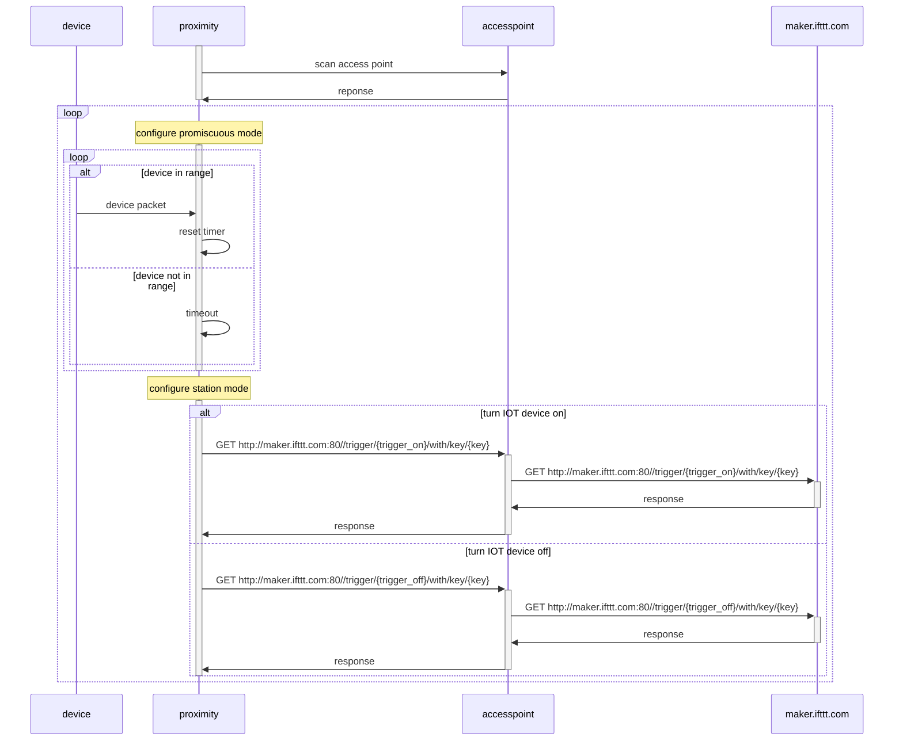

# proximity
A proximity monitor for WiFi devices.

## Configuration

The proximity monitor equired several items of configuration.
- A list of access points and passwords to try to use (makes it more portable).
- A list of devices (arbitrary name, WiFi MAC ID, and idle time) to monitor.
- An IFTTT Webhook key.
- An IFTTT Webhook 'on' trigger.
- An IFTTT Webhook 'off' trigger.

## Operation

The proximity monitor determines a local WiFi access point and channel to use,
then configures to sniff packets (promiscuous mode) until it identifies a packet
related to any of the configured devices, or until it has not seen one of those
packets for more than the configured idle time.

If the in-range or out-of-range state changes, the proximity monitor exits
promiscuous mode, enters normal station mode, and sends the appropriate on or
off trigger to IFTTT.

And then loops.

## Interactions

The basic interactions are as shown in the following sequence diagram.

